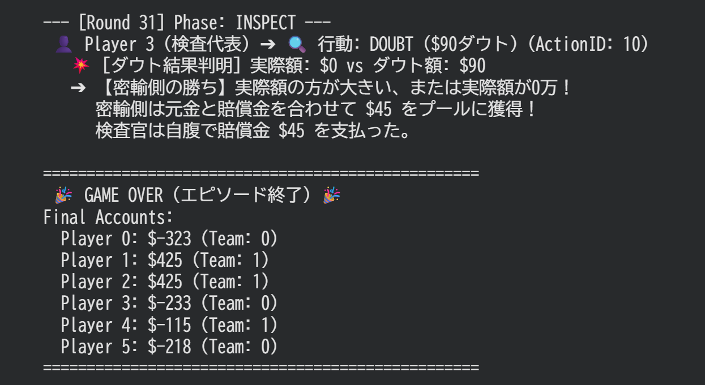

# Liar-Game_Smuggling-Game
ライアーゲームの密輸ゲームをRLできるようにルール調整した環境です。

---

# Smuggling Game RL Environment

ライアーゲームの「密輸ゲーム」をベースに設計された、6人プレイのマルチエージェント強化学習（DRL）シミュレーション環境、およびDQNエージェントの実装一式です。

このプロジェクトでは、ゲームの進行（投票・密輸・検査・分配）を状態遷移フェーズとして厳密に管理し、フェーズごとに異なるアクション空間に対応する独立したニューラルネットワーク（Q-Network）を用いて強化学習を行います。

---

## 🛠 プロジェクト構成

* **`phase.py`**: ゲームの状態を表すフェーズ（`VOTE`, `SMUGGLE`, `INSPECT`, `DISTRIBUTE`, `PUBLIC_UPDATE`, `TERMINATED`）の定義。
* **`state.py`**: プレイヤー情報、チーム情報、ラウンド履歴、およびゲーム全体のグローバル状態を管理するデータクラス群。
* **`env.py`**: ゲームのルール、各フェーズの行動処理、合法手マスク（`legal_action_mask`）、および精算ロジックを含む環境クラス。
* **`qnet.py`**: Dueling DQN アーキテクチャおよび LayerNorm、残差結合（Residual Block）を導入したフェーズごとのQネットワーク。
* **`buffer.py`**: フェーズごとの遷移（Transition）データを、固定長パディングを用いて個別に保存・サンプリングするリプレイバッファ。
* **`dqn_agent.py`**: $\epsilon$-greedyによる行動選択、およびフェーズを跨いだ特殊なターゲットQ値計算を行うDQNエージェントの実装。
* **`processor.py`**:stateへの変換およびtensorへの変換。

---

## 🎲 ゲームルールと状態遷移の概要

本環境は6人のプレイヤーで進行し、3人ずつの2チーム（チーム0 / チーム1）に分かれて合計30ラウンド戦います。各ラウンドは「往路」と「復路」の2ターンで構成され、攻守（密輸側と検査側）を入れ替えます。

### 1. VOTE（投票フェーズ）

* **概要**: チームの中から今回のターンを戦う「代表者」を投票で1人決定します。
* **制約**: 自分と同じチームのメンバー（自分を含む3人）にしか投票できません。
* **アクションサイズ**: 6（ただし自チーム以外はマスクされ選択不可）

このフェーズはのちのち裏切りを実装した際に効いてくるはずです

### 2. SMUGGLE（密輸フェーズ）

* **概要**: 密輸側の代表者が、自国の国外口座からお金を引き出し、スーツケースに入れて密輸を試みます。
* **アクション空間**: 「実際の密輸額（$0〜$100）」$\times$「税関への申告額（$0〜$100万）」の組み合わせ。それぞれ10万単位（11択 $\times$ 11択）のため、**合計121次元**。
* **制約**: 実際の密輸額は、現在の自国の国外口座残高を超えることはできません。

### 3. INSPECT（検査フェーズ）

* **概要**: 検査官側の代表者が、密輸側の申告額に対してアクションを起こします。
* **アクション空間**: 「PASS（不検査）」または「DOUBT（$0〜$100の指定額ダウト）」。**合計12次元**（PASSが1択、ダウト額が11択）。
* **勝敗ロジック**:
* **PASS**: 検査なし。実際の密輸額がそのまま密輸側チームのプール（利益）になります。
* **DOUBT**:
* 「実際の額 $\le$ ダウト額」かつ実際の額が0でない場合、**検査官の勝利**。実際額がそのまま検査官側のプールになります。
* 「実際の額 $>$ ダウト額」の場合、**密輸側の勝利**。密輸額に加えて、ペナルティ（ダウト額の半分）を検査官代表の個人口座から慰謝料として奪い、プールに加算します。


* **制約**: 検査官は、失敗時の慰謝料（ダウト額の半分）を支払えるだけの個人口座残高がない場合、その額のダウトは選択できません。

### 4. DISTRIBUTE（分配フェーズ / 自動処理）

* そのターンに勝利したチームのメンバー全員で、プールされた利益（`gain_amount`）を均等に山分け（自動分配）します。

ここは原作にはないですが、今後裏切りを実装する際のフェーズになります

### 5. PUBLIC_UPDATE（公開情報更新・交代 / 自動処理）

* 代表者をリセットし、攻守を交代します。往路・復路が共に終わればラウンド数をインクリメントします。規定ラウンド（30）に達した場合は `TERMINATED` へ移行します。

### 6. TERMINATED（最終清算）

* ゲーム終了時、相手チームの国外口座に残ったお金を自チームで山分けします。
* 最後に、全プレイヤーは初期債務（借金）として **$400** が個人口座から差し引かれ、最終的な残高が確定します。
* **報酬（Reward）**: ゲーム終了時にのみ与えられ、`最終個人口座残高 / 100` が各プレイヤーの報酬となります（途中フェーズの報酬はすべて `0`）。

---

## 🤖 強化学習（DQN）の実装アプローチの特徴

### 1. フェーズごとに独立したQネットワーク

ゲームのフェーズによってアクション空間の次元が全く異なるため、3つの独立したネットワークを用意しています。

* `VoteQNet`: アクション空間 6
* `SmuggleQNet`: アクション空間 121
* `InspectQNet`: アクション空間 12

各ネットワークは、共通の `ResidualBlock`（LayerNorm + Linear + ReLU + 残差結合）と、Dueling DQN構造（State Value $V$ と Advantage $A$ の分離）を採用しており、不合法な手のアドバンテージを $-1e9$ に落とすマスク処理が組み込まれています。

### 2. フェーズを跨ぐ Bellman 方程式（クロス・フェーズ学習）

通常のDQNは同一ネットワークの次状態の最大Q値（$\max Q(s', a')$）を参照しますが、本環境では「現在のフェーズのアクションの価値は、次のフェーズを担当するネットワークの予測価値に依存する」という設計になっています。

* `VOTE` の学習には、次フェーズである `SMUGGLE` ネットワークの価値を使用。
* `SMUGGLE` の学習には、次フェーズである `INSPECT` ネットワークの価値を使用。
* `INSPECT` の学習には、次フェーズである `VOTE` ネットワークの価値を使用。

```python
# 例：SMUGGLEフェーズのアップデート時のターゲットQ値計算（Double DQN方式）
next_q_online = inspect_net(next_states, next_masks)        # オンラインネットで行動選択
next_actions = next_q_online.argmax(dim=1, keepdim=True)
next_q_target = target_inspect_net(next_states, next_masks) # ターゲットネットで価値評価

```

### 3. マスクパディングとバッファ管理

リプレイバッファ（`ReplayBuffer`）はフェーズごとにデータを分離して保存します。各フェーズで合法手マスク（`mask`）のサイズ（6, 121, 12）が異なるため、バッファ保存時に**最大サイズである「121」にゼロパディングして固定長化**することで、PyTorch Tensorへの一括変換時の一致エラーを防いでいます。

### 4. 有効アクション不在（デッドエンド）対策

自動処理フェーズなどを挟む関係上、`next_masks` に合法手（1）が一つも存在しないバッチ行が発生し、Q値が $-1e9$ に化けてLossが爆発するのを防ぐため、有効な行動がない遷移先に対しては強制的に `next_q = 0.0` とする安全弁が組み込まれています。


## 結果と課題



>図:ゲーム終了時

とりあえず学習させてみましたが、一度マイナス域に行くと焦って極端な行動に走る挙動を確認。序盤のリードがそのまま大勝に繋がっている。

これは、遅延報酬が主な原因だと思われるので、エピソード途中の中間報酬を追加することで調整します。
